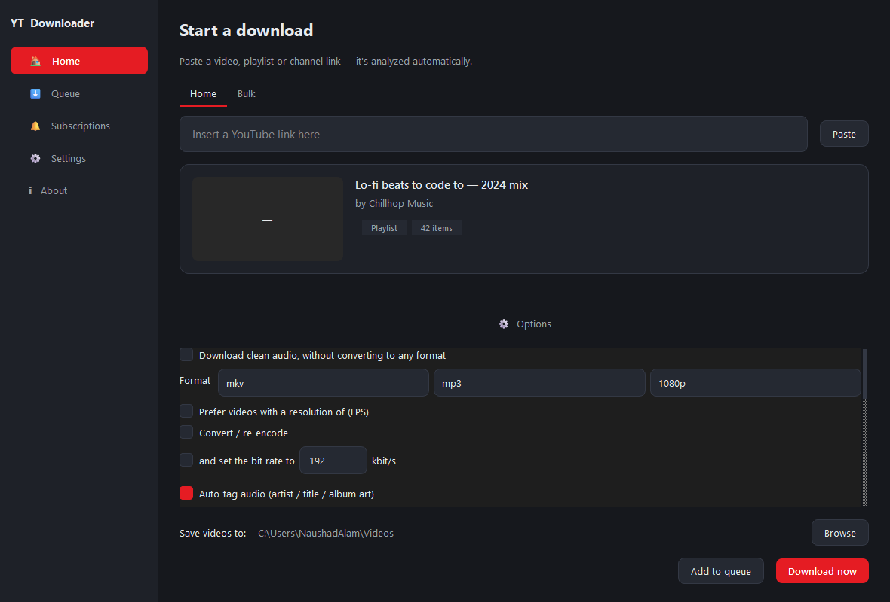

# YouTube Playlist Downloader — Python / PySide6 rewrite

A ground-up Python port of [shaked6540/YoutubePlaylistDownloader][orig] (originally
a WPF / .NET desktop app). Same idea — download whole playlists, channels or single
videos, convert them, tag them — rebuilt on **yt-dlp + FFmpeg** with a modern
**PySide6 (Qt 6)** interface.



## Features

| | |
|---|---|
| **Sources** | Single videos, playlists, channels (`/@handle`, `/channel/UC…`, `/user/…`), and a bulk "one link per line" tab |
| **Audio** | Extract to mp3 / m4a / aac / opus / flac / wav / ogg, optional fixed bitrate |
| **Video** | mp4 / mkv / webm / mov, target resolution 144p–4320p, "prefer highest FPS", optional re-encode |
| **Subtitles** | Download + embed, pick languages, include auto-generated |
| **Tagging** | Auto-tag audio from the video title (`[Genre] Artist - Title`), album/track from the playlist, embedded cover art |
| **Filenames** | Template tokens: `$title $index $artist $songtitle $channel $playlist $genre $videoid` |
| **Selection** | Per-item checkable list for playlists/channels, plus item range (subset) and a duration filter (shorter/longer than N minutes), skip files that already exist |
| **Queue** | Concurrent downloads (configurable), pause / resume / cancel / retry per job, "open folder", and **unfinished downloads are offered for resume on next launch** |
| **Subscriptions** | Track channels/playlists; manual or background auto-check on an interval; new uploads auto-queue |
| **Queue survival** | Unfinished jobs are saved on exit and offered for resume next launch |
| **Tray** | Minimises to the system tray while downloading; desktop notification when the queue finishes |
| **UI** | Light / Dark / follow-system themes, 20+ accent colours, **14 fully-translated languages** incl. RTL for Arabic & Hebrew, Help page |
| **Updates** | Checks the GitHub releases API and points you at the new version |
| **Convenience** | Drag a link onto the window, paste button, live "Analyzing…" as you type, `Ctrl+1…6` / `Ctrl+L` shortcuts, remembers window size |

## Install & run

Requires **Python 3.10+** and **FFmpeg** on your `PATH`
([download](https://ffmpeg.org/download.html) / `winget install Gyan.FFmpeg`).

```bash
python -m venv .venv
.venv\Scripts\activate            # Windows;  source .venv/bin/activate elsewhere
pip install -r requirements.txt
python -m ytpdl
```

Or install it as a package (adds a `ytpdl` GUI entry point):

```bash
pip install -e .
ytpdl
```

## FFmpeg

Needed for video downloads, format conversion and subtitle embedding (audio-only
works without it). `ytpdl.core.ffmpeg` looks for it in this order:

1. next to the app — `./ffmpeg[.exe]`, `./bin/`, or `./ffmpeg/bin/`
2. on `PATH`
3. the binary vendored by `imageio-ffmpeg` (`pip install "ytpdl[ffmpeg]"`)

If none is found the Home screen shows a banner explaining what won't work.

## Building a standalone executable

```bash
pip install -e ".[dev]"
pyinstaller ytpdl.spec
```

The result lands in `dist/YouTube Playlist Downloader/`. Drop an `ffmpeg` binary
next to the executable (or in `bin/`) and it will be picked up automatically.

## Project layout

```
ytpdl/
  config.py            paths & constants (app-data dir, temp dir, accent palette)
  i18n/                translator + locales/<code>.json (imported from the WPF .xaml files)
  core/
    settings.py        AppSettings + DownloadSettings dataclasses, JSON store
    models.py          VideoInfo / ResolvedSource value objects (+ (de)serialization)
    resolver.py        link -> ResolvedSource via yt-dlp (flat metadata)
    ffmpeg.py          locate an FFmpeg binary (bundled / PATH / imageio-ffmpeg)
    downloader.py      DownloadJob: one yt-dlp run, Qt progress signals, temp-then-move
    queue.py           DownloadQueue: thread pool + job list + resume-on-restart
    titleparse.py      "[Genre] Artist - Title" heuristics (ported from GlobalConsts)
    filenames.py       filename-template expansion + sanitising
    tagging.py         mutagen tag pass on finished audio
    subscriptions.py   subscription store + new-upload diffing
    updater.py         GitHub release check
  ui/
    theme.py           light/dark QSS built from a palette + accent
    main_window.py     nav rail + stacked pages, tray, notifications, shortcuts
    pages/             home, queue, subscriptions, settings, help, about
    widgets/           download-options form, queue row, async thumbnail, toast

scripts/convert_languages.py     one-shot .xaml -> .json locale importer
scripts/translations_extra.py    translations for new UI strings (13 locales)
scripts/merge_translations.py    folds the above into the locale JSON files
scripts/make_icon.py             regenerates resources/app.png + app.ico
scripts/manual_*.py              headless smoke test / screenshots / a real download
```

## Notes on parity with the original

* The original bundled its own `ffmpeg.exe`, an Inno Setup installer and an
  on-exit self-updater. Here FFmpeg is an external dependency and "update" is a
  notification + link (Python apps update via `pip` or a rebuilt bundle).
* yt-dlp replaces the hand-rolled `YoutubeExplode` stream selection and the manual
  FFmpeg process orchestration — quality/FPS/language preferences map onto its
  `format_sort`.
* All 14 original translations were imported verbatim from the WPF resource
  dictionaries; the ~70 strings the redesigned UI added are translated into every
  locale too (`scripts/translations_extra.py`), with an English fallback net for
  anything that slips through.

## Licence

GPL-3.0-or-later, matching the upstream project.

[orig]: https://github.com/shaked6540/YoutubePlaylistDownloader
